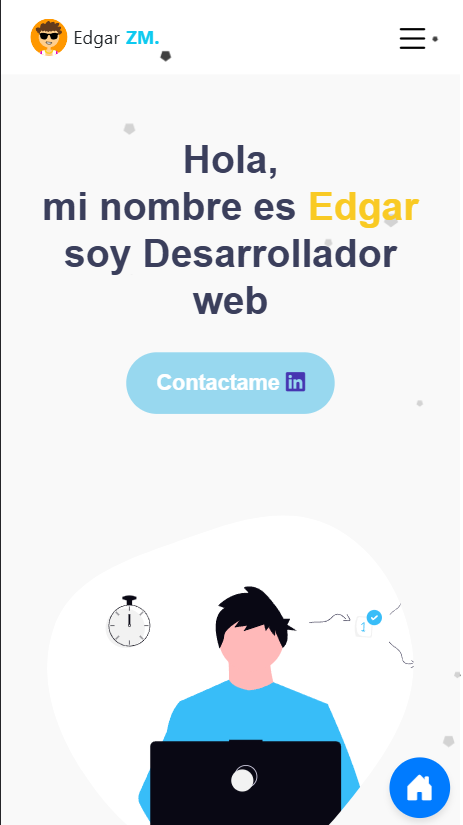
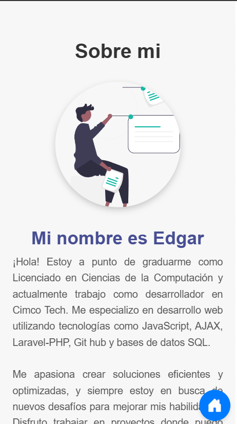
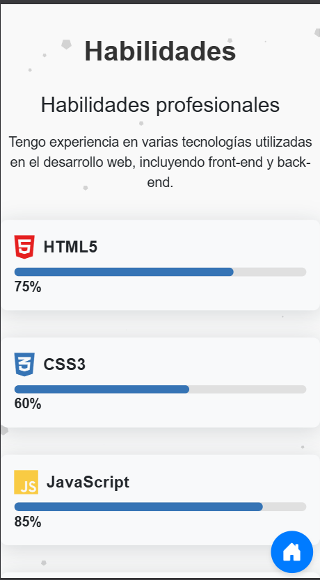
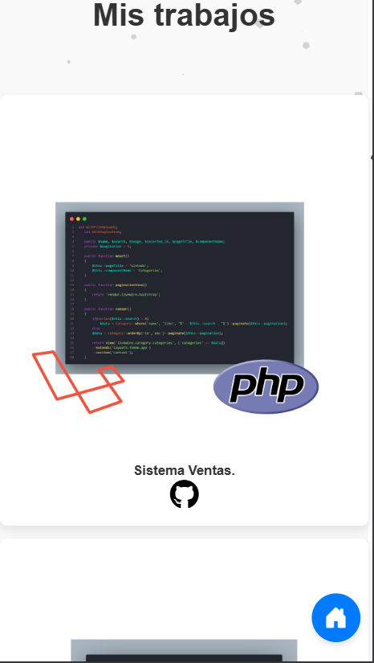
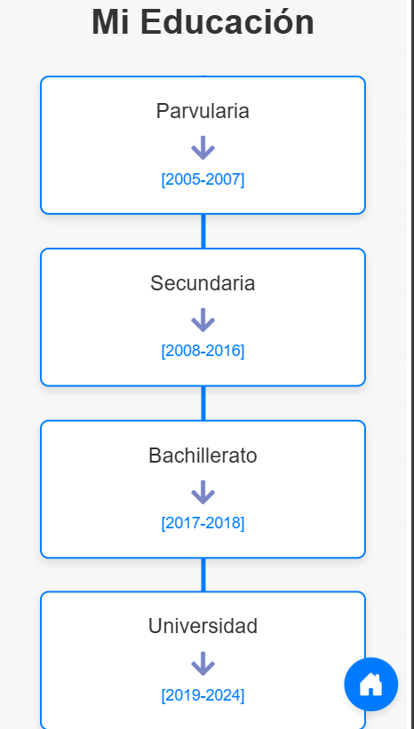
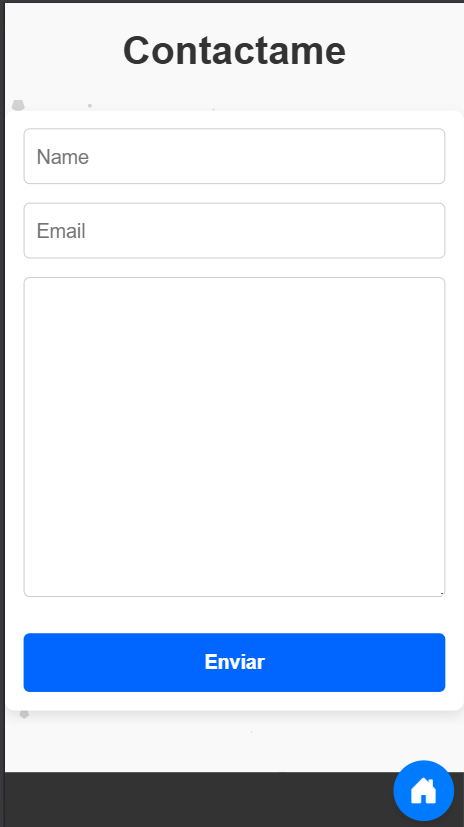

# Portfolio Web - Edgar Morán

## Descripción
Este es mi portafolio web desarrollado con HTML, CSS, JavaScript y Bootstrap 5. Presenta información sobre mi persona Edgar Morán, mis habilidades, experiencia profesional y proyectos destacados. El diseño es moderno y responsivo, adaptándose a diferentes dispositivos.

## Tecnologías Utilizadas
- **HTML5**
- **CSS3**
- **Bootstrap 5**
- **JavaScript**
- **FontAwesome**
- **Bootstrap Icons**

## Características
- **Diseño Responsivo**: Se adapta a dispositivos móviles, tablets y escritorios.
- **Secciones Dinámicas**: Presenta información sobre el usuario, habilidades, proyectos y contacto.
- **Animaciones con CSS y JavaScript**: Mejora la experiencia del usuario.
- **Integración con Redes Sociales**: Enlaces a LinkedIn y GitHub.

## Estructura del Proyecto
```
/portfolio-web
│── index.html       # Archivo principal del sitio web
│── css/
│   └── style.css    # Estilos personalizados
│── img/             # Carpeta para imágenes y SVG
│── js/
│   └── scripts.js   # Archivo JavaScript para interacciones
```

## Instalación y Uso
1. Clonar el repositorio:
   ```bash
   git clone https://github.com/Esau21/vanilla-js-portfolio.git
   ```
2. Abrir el archivo `index.html` en un navegador.

## Capturas de Pantalla
_capturas de pantalla aquí para mostrar la apariencia del portafolio._
     

## Contacto
Si deseas ponerte en contacto, puedes escribirme a:
- **LinkedIn**: [linkedin.com/in/edgar-moran](https://www.linkedin.com/in/edgar-moran-0a212124a/)
- **Correo**: esaumoran1999@gmail.com

---
**Autor:** Edgar Morán  
**Licencia:** MIT